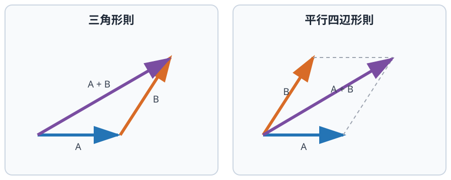
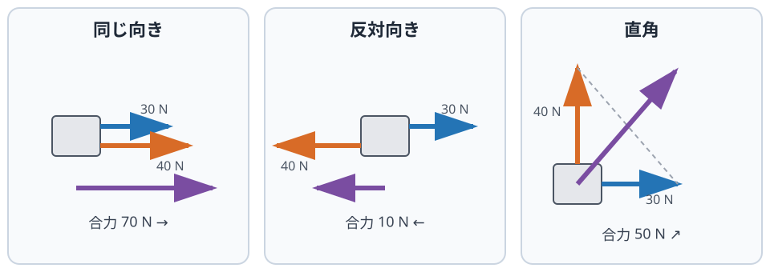
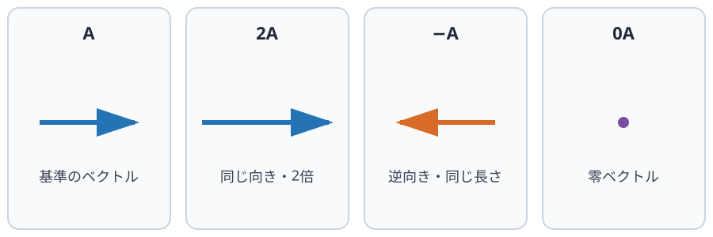
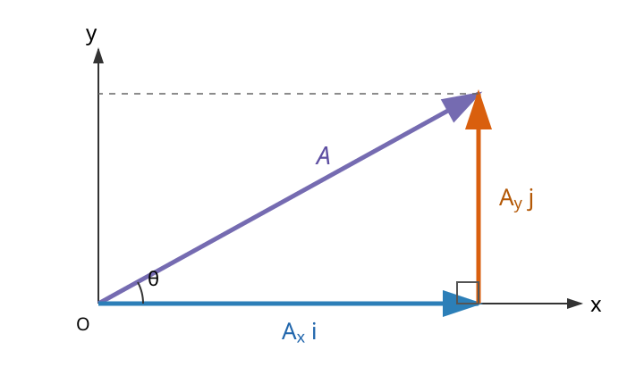

物理学における多くの量は、数値だけでは表せない。位置、速度、加速度、力、電場、磁場などは、大きさと向きをあわせもつ**ベクトル**として記述される。

平面上のベクトル $\boldsymbol{A}$ を、横向きの $x$ 成分と縦向きの $y$ 成分に分けると、

$$
\boldsymbol{A}
=
\begin{pmatrix}
A_x\\
A_y
\end{pmatrix}
$$

と表せる。この章では、この成分表示を使ってベクトルの基本操作を学び、それぞれの操作が物理現象の中で何を意味するのかを考える。

## ベクトルの基本計算とその物理的意味

物理学で多用される四つの基本操作について、数学的な計算方法と、それが物理現象において何を意味するのかを整理する。

### ① ベクトルの加法（足し算）

- **計算**：対応する成分をそのまま足す。

$$
\boldsymbol{A}+\boldsymbol{B}
=
\begin{pmatrix}
A_x+B_x\\
A_y+B_y
\end{pmatrix}
$$

図では、$\boldsymbol{A}$ の終点に $\boldsymbol{B}$ の始点をつなぐ。$\boldsymbol{A}$ の始点から $\boldsymbol{B}$ の終点へ向かう矢印が $\boldsymbol{A}+\boldsymbol{B}$ である。二つの始点をそろえ、平行四辺形の対角線を引いても同じ結果になる。

{#fig-vector-addition fig-alt="左ではAの終点にBの始点を置き、Aの始点からBの終点までをA+Bとする。右ではAとBを同じ始点から描き、平行四辺形の対角線をA+Bとする。"}

- **物理的意味**：「効果の重ね合わせ」

一つの物体に複数の力 $\boldsymbol{F}_1,\boldsymbol{F}_2,\ldots$ が働くとき、それらを足し合わせたベクトルを**合力** $\boldsymbol{F}$ という。

$$
\boldsymbol{F}
=\boldsymbol{F}_1+\boldsymbol{F}_2+\cdots
$$

同じ向きの力は強め合い、反対向きの力は打ち消し合う。異なる向きの力は、大きさだけを足すのではなく、ベクトルとして合成する。

たとえば、右向きに $30\,\mathrm{N}$、上向きに $40\,\mathrm{N}$ の力が同時に働くとする。それぞれを

$$
\boldsymbol{F}_1
=
\begin{pmatrix}
30\\
0
\end{pmatrix}
\mathrm{N},
\qquad
\boldsymbol{F}_2
=
\begin{pmatrix}
0\\
40
\end{pmatrix}
\mathrm{N}
$$

と表すと、合力は

$$
\boldsymbol{F}
=
\begin{pmatrix}
30\\
40
\end{pmatrix}
\mathrm{N}
$$

となる。その大きさは三平方の定理から

$$
|\boldsymbol{F}|
=\sqrt{(30\,\mathrm{N})^2+(40\,\mathrm{N})^2}
=50\,\mathrm{N}
$$

であり、向きは斜め右上である。

{#fig-pulling-vectors fig-alt="同じ二力でも、同じ向きでは70 N、反対向きでは10 N、直角では斜め方向へ50 Nの合力となる。"}

力だけでなく、変位や電場もベクトルの加法で重ね合わせられる。ただし、力と速度のように種類の異なる物理量を足すことはできない。

::: {.callout-tip title="手を動かす 1"}
東向きに $3\,\mathrm{N}$、北向きに $4\,\mathrm{N}$ の力が働いている。合力の成分、大きさ、およその向きを求めよ。

解答

合力は

$$
\boldsymbol{F}
=
\begin{pmatrix}
3\\
4
\end{pmatrix}
\mathrm{N}
$$

である。大きさは $\sqrt{3^2+4^2}=5\,\mathrm{N}$、向きは北東方向である。

:::

### ② ベクトルのスカラー倍（実数倍）

- **計算**：各成分を同じ実数 $k$ 倍にする。

$$
k\boldsymbol{A}
=
\begin{pmatrix}
kA_x\\
kA_y
\end{pmatrix}
$$

$k>0$ なら向きは変わらず、大きさが $k$ 倍になる。$k<0$ なら向きが反対になり、大きさが $|k|$ 倍になる。$k=0$ なら零ベクトル $\boldsymbol{0}$ になる。

{#fig-scalar-multiplication fig-alt="Aに対し、2Aは同じ向きで2倍、マイナスAは逆向きで同じ長さ、0Aは零ベクトルになる。"}

- **物理的意味**：「ベクトル量の比例関係」

運動方程式

$$
\boldsymbol{F}=m\boldsymbol{a}
$$

は、加速度ベクトル $\boldsymbol{a}$ を質量 $m$ 倍すると、合力 $\boldsymbol{F}$ になるという関係を表している。質量は正のスカラーなので、合力と加速度の向きは同じである。

同じ質量の物体なら、合力を2倍にすると加速度も2倍になる。一方、同じ合力を質量が2倍の物体に加えると、加速度は $1/2$ 倍になる。スカラー倍を使うと、大きさの比例関係と向きの関係を一つの式で表せる。

::: {.callout-tip title="手を動かす 2"}
大きさ $6\,\mathrm{N}$、東向きの力を $\boldsymbol{F}$ とする。$2\boldsymbol{F}$、$-\boldsymbol{F}$、$-\frac12\boldsymbol{F}$ の大きさと向きを答えよ。

解答

- $2\boldsymbol{F}$：$12\,\mathrm{N}$、東向き
- $-\boldsymbol{F}$：$6\,\mathrm{N}$、西向き
- $-\frac12\boldsymbol{F}$：$3\,\mathrm{N}$、西向き

:::

### ③ ベクトルの内積（ドット積）

- **計算**：対応する成分の積を足す。

$$
\boldsymbol{A}\cdot\boldsymbol{B}
=A_xB_x+A_yB_y
$$

二つのベクトルのなす角を $\phi$ とすると、同じ内積を

$$
\boldsymbol{A}\cdot\boldsymbol{B}
=|\boldsymbol{A}|\,|\boldsymbol{B}|\cos\phi
$$

とも表せる。内積の結果はベクトルではなく、実数、すなわちスカラーである。

- **物理的意味**：「ある方向への寄与を取り出す」

$|\boldsymbol{A}|\cos\phi$ は、$\boldsymbol{A}$ のうち $\boldsymbol{B}$ の向きに沿う成分である。内積は、一方のベクトルがもう一方の向きにどれだけ寄与しているかを取り出す。

一定の力 $\boldsymbol{F}$ が働く中で、物体が $\boldsymbol{x}$ だけ変位したとき、力がした仕事 $W$ は

$$
W=\boldsymbol{F}\cdot\boldsymbol{x}
=|\boldsymbol{F}|\,|\boldsymbol{x}|\cos\phi
$$

である。移動方向と同じ向きの力は正の仕事をし、反対向きの力は負の仕事をする。力が移動方向に垂直なら、$\cos90^\circ=0$ なので仕事は0になる。

たとえば、そりを進行方向から $60^\circ$ 上向きに $10\,\mathrm{N}$ で引き、水平に $2\,\mathrm{m}$ 移動させたとする。仕事は

$$
W
=(10\,\mathrm{N})(2\,\mathrm{m})\cos60^\circ
=10\,\mathrm{J}
$$

である。斜めの力のすべてではなく、進行方向に沿う成分だけが仕事に寄与する。

::: {.callout-tip title="手を動かす 3"}
物体が東へ $3\,\mathrm{m}$ 移動した。次の力がした仕事を求めよ。

1. 東向きに $4\,\mathrm{N}$
2. 西向きに $4\,\mathrm{N}$
3. 北向きに $4\,\mathrm{N}$

解答

1. $W=(4)(3)\cos0^\circ=12\,\mathrm{J}$
2. $W=(4)(3)\cos180^\circ=-12\,\mathrm{J}$
3. $W=(4)(3)\cos90^\circ=0\,\mathrm{J}$

:::

### ④ ベクトルの外積（クロス積）

- **計算**：$\boldsymbol{A}$ と $\boldsymbol{B}$ の両方に垂直な、新しいベクトルを作る。その大きさは

$$
|\boldsymbol{A}\times\boldsymbol{B}|
=|\boldsymbol{A}|\,|\boldsymbol{B}|\sin\phi
$$

である。向きは右ねじの規則で決める。$\boldsymbol{A}$ から $\boldsymbol{B}$ へ右ねじを回したとき、ねじが進む向きが $\boldsymbol{A}\times\boldsymbol{B}$ の向きである。

順序を逆にすると、外積の向きも反対になる。

$$
\boldsymbol{B}\times\boldsymbol{A}
=-(\boldsymbol{A}\times\boldsymbol{B})
$$

- **物理的意味**：「回転の軸と向き、垂直な効果を表す」

位置ベクトル $\boldsymbol{r}$ の点に力 $\boldsymbol{F}$ を加えたとき、力のモーメント $\boldsymbol{\tau}$ は

$$
\boldsymbol{\tau}=\boldsymbol{r}\times\boldsymbol{F}
$$

で表される。その大きさは

$$
|\boldsymbol{\tau}|
=|\boldsymbol{r}|\,|\boldsymbol{F}|\sin\phi
$$

である。ドアを回すとき、蝶番から遠い場所を、ドアに垂直な向きへ押すほど回しやすい。反対に、蝶番の近くを押したり、ドアの面に沿って押したりすると回転の効果は小さくなる。

磁場中を動く電荷が受けるローレンツ力も外積で表される。

$$
\boldsymbol{F}=q\boldsymbol{v}\times\boldsymbol{B}
$$

この力は、速度 $\boldsymbol{v}$ と磁場 $\boldsymbol{B}$ の両方に垂直な向きに働く。外積は、二つの向きから、それらに直交する効果を作る操作である。

::: {.callout-tip title="手を動かす 4"}
蝶番から $0.8\,\mathrm{m}$ 離れた取っ手を $10\,\mathrm{N}$ で押す。

1. ドアに垂直な向きへ押したときのモーメントの大きさを求めよ。
2. ドアの面に沿って蝶番の方向へ押したときのモーメントの大きさを求めよ。

解答

1. なす角は $90^\circ$ なので、$\tau=(0.8)(10)\sin90^\circ=8\,\mathrm{N\,m}$。
2. なす角は $180^\circ$ なので、$\tau=(0.8)(10)\sin180^\circ=0\,\mathrm{N\,m}$。

:::

## ベクトルの線形性と物理現象の処理

ベクトルの加法とスカラー倍には、計算の順序を変えたり、式を分配したりできる性質がある。

$$
\begin{aligned}
\boldsymbol{A}+\boldsymbol{B}
&=\boldsymbol{B}+\boldsymbol{A},\\
(\boldsymbol{A}+\boldsymbol{B})+\boldsymbol{C}
&=\boldsymbol{A}+(\boldsymbol{B}+\boldsymbol{C}),\\
k(\boldsymbol{A}+\boldsymbol{B})
&=k\boldsymbol{A}+k\boldsymbol{B}
\end{aligned}
$$

このような性質を利用すると、多次元のベクトルを成分へ分け、それぞれを数として計算し、最後に再び一つのベクトルへまとめられる。

### 現象を処理する三つの段階

ベクトルを使う物理計算は、次の三つの段階に整理できる。

1. **成分分解**：ベクトルを $x$ 軸方向と $y$ 軸方向に分ける。
2. **各成分で立式・計算**：それぞれを1次元の量として計算する。
3. **再統合**：各成分の結果を一つのベクトルへ戻す。

たとえば、斜め右上を向くベクトル $\boldsymbol{A}$ は、横向きと縦向きの二つのベクトルの和として表せる。

{#fig-vector-components fig-alt="原点から斜め右上へ向かうベクトルAを、x軸方向のAx iとy軸方向のAy jを順につないだ二つの直交成分に分けている。"}

$$
\boldsymbol{A}=A_x\boldsymbol{i}+A_y\boldsymbol{j}
$$

ただし、ベクトル計算に線形性があることと、すべての物理現象が線形であることは同じではない。力が位置に複雑に依存する場合や、物体が糸などで拘束される場合には、$x$ 成分と $y$ 成分の式が互いに関係することもある。それでも、一本のベクトル方程式を成分ごとに書くことはできる。

## 基底ベクトルと成分分解の根拠

2次元の直交座標系において、$x$ 軸の正方向を向く大きさ1のベクトルを $\boldsymbol{i}$、$y$ 軸の正方向を向く大きさ1のベクトルを $\boldsymbol{j}$ とする。これらを**基底ベクトル**という。

どのベクトル $\boldsymbol{A}$ も、この二つの基底ベクトルを使って

$$
\boldsymbol{A}
=A_x\boldsymbol{i}+A_y\boldsymbol{j}
$$

とただ一通りに表せる。$A_x$ と $A_y$ は、選んだ座標軸に沿ってベクトルを測った成分である。

### 運動方程式を成分へ分ける

力と加速度を基底ベクトルで表す。

$$
\boldsymbol{F}=F_x\boldsymbol{i}+F_y\boldsymbol{j},
\qquad
\boldsymbol{a}=a_x\boldsymbol{i}+a_y\boldsymbol{j}
$$

これらを運動方程式 $\boldsymbol{F}=m\boldsymbol{a}$ に代入すると、

$$
F_x\boldsymbol{i}+F_y\boldsymbol{j}
=m(a_x\boldsymbol{i}+a_y\boldsymbol{j})
$$

となる。右辺を分配すると、

$$
F_x\boldsymbol{i}+F_y\boldsymbol{j}
=(ma_x)\boldsymbol{i}+(ma_y)\boldsymbol{j}
$$

となる。

$\boldsymbol{i}$ と $\boldsymbol{j}$ は向きが異なり、一方を何倍しても他方を作れない。この性質を**線形独立**という。そのため、二つのベクトルが等しければ、$\boldsymbol{i}$ と $\boldsymbol{j}$ の係数がそれぞれ等しくなければならない。

$$
\begin{cases}
F_x=ma_x,\\
F_y=ma_y
\end{cases}
$$

これが、一本のベクトル方程式を、成分ごとの二本のスカラー方程式として計算できる数学的な根拠である。

## 具体例：斜方投射

ボールを速さ $v_0$、水平方向から角度 $\theta$ で投げ上げる。空気抵抗を無視し、鉛直下向きに一定の重力加速度 $g$ が働くとする。

### 1. 成分分解

初速度ベクトル $\boldsymbol{v}_0$ と重力加速度ベクトル $\boldsymbol{g}$ は、

$$
\boldsymbol{v}_0
=
\begin{pmatrix}
v_0\cos\theta\\
v_0\sin\theta
\end{pmatrix},
\qquad
\boldsymbol{g}
=
\begin{pmatrix}
0\\
-g
\end{pmatrix}
$$

と表せる。

### 2. 各成分で計算

$x$ 軸方向には加速度がないので、一定の速度 $v_0\cos\theta$ で進む。

$$
x(t)=(v_0\cos\theta)t
$$

$y$ 軸方向には一定の加速度 $-g$ が働く。

$$
y(t)=(v_0\sin\theta)t-\frac12gt^2
$$

### 3. ベクトルとして再統合

最後に、二つの成分を位置ベクトル $\boldsymbol{r}(t)$ としてまとめる。

$$
\boldsymbol{r}(t)
=
\begin{pmatrix}
x(t)\\
y(t)
\end{pmatrix}
=
\begin{pmatrix}
(v_0\cos\theta)t\\
(v_0\sin\theta)t-\frac12gt^2
\end{pmatrix}
$$

斜方投射は平面上の曲線運動である。しかし、ベクトルを成分に分けると、水平方向の等速運動と鉛直方向の等加速度運動として計算できる。詳しい運動公式とグラフは、運動を扱う後の章で学ぶ。

## まとめ

ベクトルの基本操作は、物理現象を次のように整理する。

| 操作 | 計算 | 物理的意味 |
|---|---|---|
| 加法 | 対応する成分を足す | 効果を重ね合わせる |
| スカラー倍 | 各成分を同じ実数倍にする | 大きさの比例関係と向きを表す |
| 内積 | 成分の積の和をとる | ある方向への寄与を取り出す |
| 外積 | 大きさ $AB\sin\phi$、向きは両方に垂直 | 回転の軸と向き、垂直な効果を表す |

複雑な現象では、ベクトルを座標軸に沿って分解し、成分ごとに式を立て、最後に一つのベクトルへ戻す。この処理によって、向きのある物理量を大きさだけの計算へ一時的に分けながら、最後まで向きの情報を失わずに扱える。

::: {.callout-warning title="この章は執筆途中です"}
今後、座標系の選び方、内積と外積の図、章末問題、ベクトルと微分による円運動を追加する。
:::
